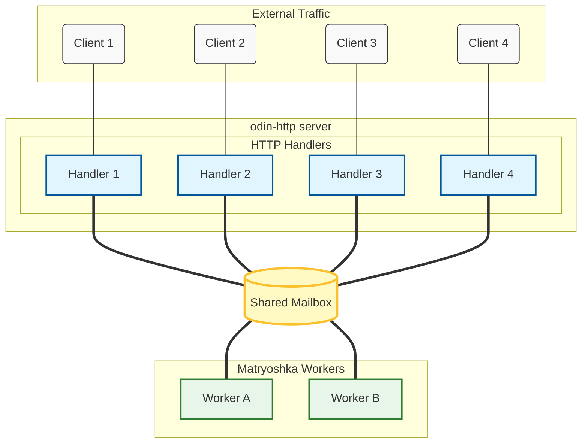

# matryoshka-http-template

A template repository demonstrating server-side Odin architecture using:
- [matryoshka](https://github.com/g41797/matryoshka) — building blocks
- [odin-http](https://github.com/laytan/odin-http) — HTTP facade

Work In Progress
