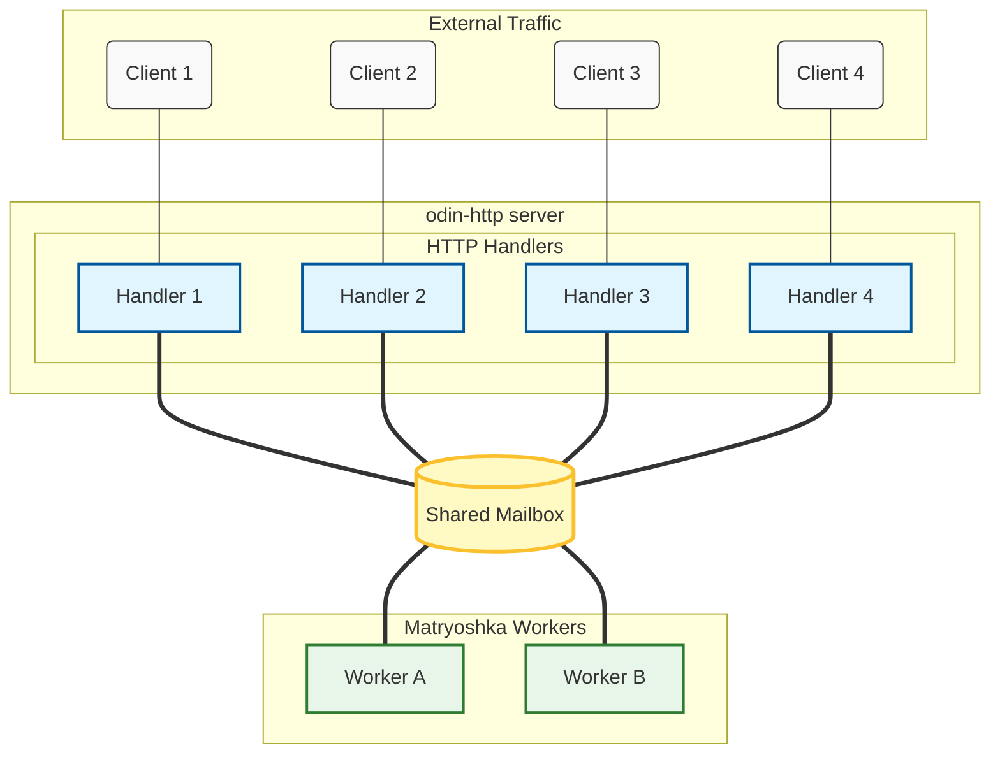

# matryoshka-http-template


[](https://github.com/g41797/matryoshka-http-template/actions/workflows/ci.yml)
[](https://github.com/g41797/matryoshka-http-template/actions/workflows/docs.yml)

A template repository demonstrating server-side Odin architecture using:
- [matryoshka](https://github.com/g41797/matryoshka) — concurrency + ownership
- [odin-http](https://github.com/laytan/odin-http) — HTTP transport

## Architecture


```
HTTP POST → handler → bridge → translator_in (Master)
                                      ↓
                               worker mailbox (MPMC)
                                      ↓
                              translator_out (Master)
                                      ↓
                         bridge ← reply mailbox ← response
```

All pipeline stages use the **same `Master` struct** from matryoshka. Behavior is differentiated only by the processing callback — not by the struct type.

## Quick Start

```sh
git clone https://github.com/g41797/matryoshka-http-template
cd matryoshka-http-template
git submodule update --init --recursive
```

Run all tests:
```sh
bash kitchen/build_and_test.sh
```

Or run a single test suite:
```sh
odin test ./tests/unit/pipeline/ -vet -strict-style -disallow-do -o:none -debug
odin test ./tests/unit/handlers/  -vet -strict-style -disallow-do -o:none -debug
odin test ./tests/functional/    -vet -strict-style -disallow-do -o:none -debug
```

## File Map

| Path | Purpose |
|------|---------|
| `pipeline/types.odin` | `Message` (PolyNode-based), tag, `Builder`, `ctor`, `dtor` |
| `pipeline/master.odin` | `Master` struct + `new_master` / `free_master` (from block2) |
| `pipeline/wiring.odin` | `Stage_Fn`, `Stage_Context`, `build_echo_pipeline`, `build_full_pipeline` |
| `pipeline/spawn.odin` | `spawn_stage`, `spawn_workers`, `shutdown_threads` |
| `handlers/bridge.odin` | HTTP ↔ pipeline boundary (only file with `http.*` types in pipeline context) |
| `handlers/handler.odin` | Thin odin-http handler registration |
| `examples/echo.odin` | Single-worker echo pipeline + HTTP server (callable from tests) |
| `examples/pipeline.odin` | Full three-stage pipeline + HTTP server |
| `examples/multi_worker.odin` | MPMC pattern: N workers sharing one mailbox |
| `tests/unit/pipeline/` | Master lifecycle and Message ctor/dtor tests |
| `tests/unit/handlers/` | Bridge round-trip tests (no HTTP server) |
| `tests/functional/` | Full HTTP round-trip via example servers |
| `vendor/matryoshka/` | git submodule |
| `vendor/odin-http/` | git submodule |

## Key Rules

1. `Message` **must** embed `PolyNode` at offset 0.
2. Tags **must** be non-nil after creation.
3. Workers **must** transfer or free every item — never reuse after `mbox_send`.
4. **No HTTP types** inside `pipeline/`.
5. All concurrency is via matryoshka mailboxes — no hidden threading.
6. Examples are callable modules, not executables — no `main`, no `/cmd`.

## What You Write

To adapt this template for your application, define:

1. Your message type (embed `PolyNode` at offset 0):
```odin
MyMsg :: struct {
    using poly: pipeline.PolyNode,
    data:       MyDomain,
    reply_to:   pipeline.Mailbox,
}
```

2. Your processing function (the worker `Stage_Fn`):
```odin
my_worker :: proc(me: ^pipeline.Master, next: pipeline.Mailbox, mi: ^pipeline.MayItem) {
    // process, then:
    pipeline.forward_to_next(me, next, mi)  // or reply_to_bridge
}
```

3. Wire and start via `examples/` pattern.

## Dependencies

Both dependencies are git submodules — no copying, no external package managers.

```sh
git submodule update --init --recursive
```
