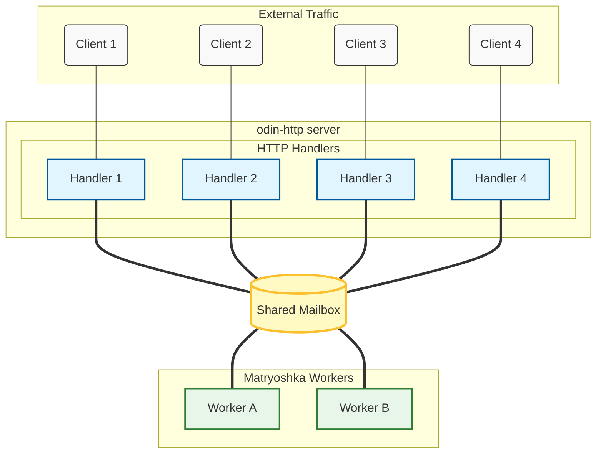

# matryoshka-http-starter — Modular Monoliths in Odin

Full scaffolding:

- HTTP handlers
- Workers Pipeline
- Examples
- Tests
- CI/CD
- Docs generation
- VSCode config

## Why this exists

I build server-side systems for a living.
Long-running, correct, boring in the best possible way.

After writing `sputnik` (Go) and `tofu` (Zig), I wanted the same thing in Odin:
explicit ownership, zero-copy message passing, and a thin HTTP layer — nothing more.

This repository is the first public Odin project that puts **matryoshka** and **odin-http** together into a complete, clone-and-go skeleton for real modular monoliths.

No framework.
No magic.
Just the pieces you actually need.

## Credits

- [matryoshka](https://github.com/g41797/matryoshka) — ownership-first concurrency building blocks (by me)
- [odin-http](https://github.com/laytan/odin-http) — clean HTTP/1.1 implementation (by laytan)

## Quick start

TBD

Clone it.
Open in VSCode.
Start writing your handlers and workers.

That’s it.

---

Made for Odin developers who want to ship real backend services without the usual ceremony.

## Why this exists
 
 
sad truth
first of all it's hard to start any Odin project with whole "environment" existing in another languages - examples, tests, readme, ci/cd documantation - lack of culture
 
without matryoshka and http - just simple template repo for the start
 
second - without server side processing and real projects - and now Odin has not any real system it will be in first 100 languages and not in first 10
 
Language is ready - devs are not

We need to start build prototypes of real systems

From something small
 
That's why it exists
